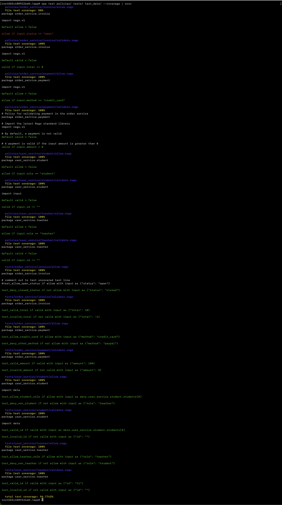

# OPA Test Container (with ocov)


This container provides a lightweight environment for testing [Open Policy Agent (OPA)](https://www.openpolicyagent.org/) policies with coverage reporting using [`ocov`](https://github.com/C5T/ocov).

**Special thanks to the authors of the [`ocov`](https://github.com/C5T/ocov) project for making coverage reporting for OPA so accessible and user-friendly. This project would not be possible without their excellent work.**

## Features
- OPA CLI (latest release)
- ocov coverage reporter
- Ready-to-use with your Rego policies, tests, and data

## Build

Build the Docker image (default platform):

```sh
docker build -t opa-ocov .
```

Or for a specific platform (e.g., for multi-arch builds):

```sh
docker build --platform=linux/amd64 -t opa-ocov .
```

## Usage

Run OPA and ocov in the container:

```sh
docker run --rm -it opa-ocov
```

Or start a shell for interactive use:

```sh
docker run --rm -it opa-ocov bash
```

## Running Coverage Reports

To generate a coverage report for your policies:

```sh
opa test <test-paths> --coverage | ocov
```

Or, to save and process coverage from a file:

```sh
opa test <test-paths> --coverage > coverage.json
ocov --input coverage.json
```

Replace `<test-paths>` with your policy/test directories or files.

## Credits

- [ocov](https://github.com/C5T/ocov) by C5T


opa test ${TEST_ARGS} --coverage | ocov

## Example Output

> **Note:** Colors shown by `ocov` in your terminal (e.g., green/red for coverage) will not appear in this README example, as Markdown does not support terminal colors.

```
root@2ae8fede7356:/app# opa test policies/ tests/ test_data/ --coverage | ocov
# policies/order_service/invoice/allow.rego
# file test coverage: 50%
package order_service.invoice

import rego.v1

default allow = false

allow if input.status == "open"

# policies/order_service/invoice/validate.rego
# file test coverage: 100%
package order_service.invoice

import rego.v1

default valid = false

valid if input.total >= 0

# policies/order_service/payment/allow.rego
# file test coverage: 100%
package order_service.payment

import rego.v1

default allow = false

allow if input.method == "credit_card"

# policies/order_service/payment/validate.rego
# file test coverage: 100%
# Policy for validating payment in the order service
package order_service.payment

# Import the latest Rego standard library
import rego.v1

# By default, a payment is not valid
default valid = false

# A payment is valid if the input amount is greater than 0
valid if input.amount > 0

# policies/user_service/student/allow.rego
# file test coverage: 100%
package user_service.student

default allow = false

allow if input.role == "student"

# policies/user_service/student/validate.rego
# file test coverage: 100%
package user_service.student

import input

default valid = false

valid if input.id != ""

# policies/user_service/teacher/allow.rego
# file test coverage: 100%
package user_service.teacher

default allow = false

allow if input.role == "teacher"

# policies/user_service/teacher/validate.rego
# file test coverage: 100%
package user_service.teacher

default valid = false

valid if input.id != ""

# tests/order_service/invoice/allow.rego
# file test coverage: 100%
package order_service.invoice

# comment out to test uncovered test line
#test_allow_open_status if allow with input as {"status": "open"}

test_deny_closed_status if not allow with input as {"status": "closed"}

# tests/order_service/invoice/validate.rego
# file test coverage: 100%
package order_service.invoice

test_valid_total if valid with input as {"total": 10}

test_invalid_total if not valid with input as {"total": -1}

# tests/order_service/payment/allow.rego
# file test coverage: 100%
package order_service.payment

test_allow_credit_card if allow with input as {"method": "credit_card"}

test_deny_other_method if not allow with input as {"method": "paypal"}

# tests/order_service/payment/validate.rego
# file test coverage: 100%
package order_service.payment

test_valid_amount if valid with input as {"amount": 100}

test_invalid_amount if not valid with input as {"amount": 0}

# tests/user_service/student/allow.rego
# file test coverage: 100%
package user_service.student

import data

test_allow_student_role if allow with input as data.user_service.student.students[0]

test_deny_non_student if not allow with input as {"role": "teacher"}

# tests/user_service/student/validate.rego
# file test coverage: 100%
package user_service.student

import data

test_valid_id if valid with input as data.user_service.student.students[0]

test_invalid_id if not valid with input as {"id": ""}

# tests/user_service/teacher/allow.rego
# file test coverage: 100%
package user_service.teacher

test_allow_teacher_role if allow with input as {"role": "teacher"}

test_deny_non_teacher if not allow with input as {"role": "student"}

# tests/user_service/teacher/validate.rego
# file test coverage: 100%
package user_service.teacher

test_valid_id if valid with input as {"id": "t1"}

test_invalid_id if not valid with input as {"id": ""}

# total test coverage: 96.7742%
```
### Screenshot showing coloring


## Old Notes
```
docker build -t opa-ocov .
docker build --platform=linux/amd64 -t opa-ocov .
docker run --rm -it opa-ocov
docker run --rm -it opa-ocov bash
```

